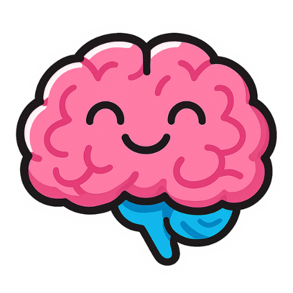

# MyBrain

"_Your personal knowledge at your fingertips_"\

   

MyBrain is a personal knowledge assistant application that helps users store and query information from various sources.

## Overview

When a user creates an account and logs into the app, they can create projects (which act like folders) to organize their knowledge. For example, a user might create a project named "TRUMP". Within a project, the user can add news articles, YouTube links, or any additional text content. These entries serve as the knowledge sources or references.

Once sources have been added, the user can ask questions via a chat interface. The application responds with answers based on the stored knowledge within the project.

## Features

- User authentication (registration and login).
- Project creation, naming, and management.
- Adding text content or YouTube links as knowledge sources to projects.
- Chat interface to query the stored knowledge and receive responses.

## Usage

1. Register and log in to your account.
2. Create a new project and give it a name.
3. Add text, news articles, or YouTube links to build your knowledge base.
4. Ask questions in the chat interface, and get answers derived from the stored information.

## Technology Stack

- **Client:** React with TypeScript, Vite, TailwindCSS
- **Backend:** Node.js with TypeScript Express
- **AI / RAG Framework:** LangChain (TypeScript), LLM APIs
- **Database:** PostgreSQL (metadata, users, projects)
- **Vector Database:** Pinecone 
- **Caching:** Redis
- **Data Ingestion:** , YouTube Transcript API, text/document parsers
- **Infrastructure:** Docker
- **API Communication:** REST APIs, WebSockets (for streaming responses)

## Development

The project is split into a `client` (React + Vite) and `server` (Node/TypeScript) components. The client handles the UI, while the server manages authentication and data storage.

This README provides essential instructions and context for understanding and working with the MyBrain application.